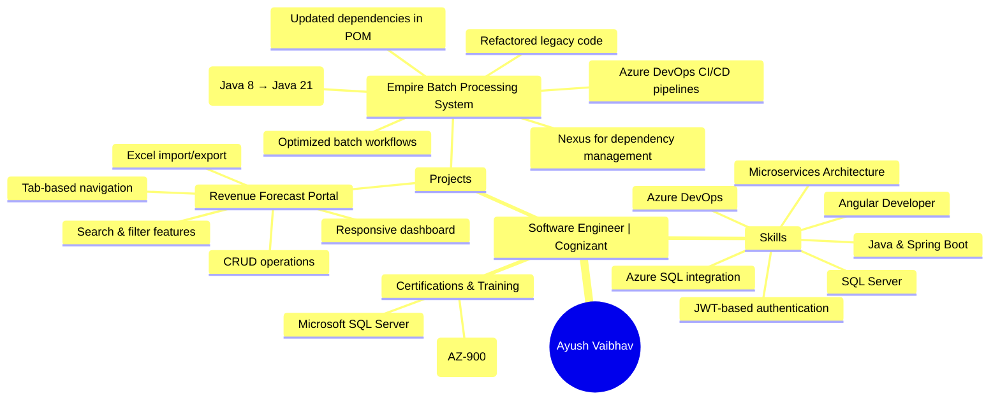

# 👋 Hi, I'm Ayush Vaibhav

<div align="center">
  
</div>



## 🎓 About Me 

- 🔭 I'm currently working as a **Full Stack Developer**
- 🌱 Specialized in **Java (Spring Boot) backend + Angular frontend**
- 💼 Expert in **Azure DevOps** and **Microservices Architecture**
- 📊 Building **Enterprise Solutions** and **Cloud Applications**
- 🎯 Creating scalable and efficient solutions for complex business problems

## � Tech Stack

### Languages & Frameworks
- Java & Spring Boot
- Angular
- TypeScript/JavaScript
- SQL

### Cloud & DevOps
- Azure DevOps
- Microservices Architecture
- Azure SQL Integration
- CI/CD Pipelines
- JWT-based Authentication

### Tools & Technologies
- SQL Server
- Azure Services
- Git & GitHub
- Maven/Gradle
- Docker

## 🚀 Featured Projects

### Revenue Forecast Portal
- Responsive dashboard with tab-based navigation
- CRUD operations with search & filter features
- Excel import/export functionality
- Role-based authentication (EDL Management)
- Azure SQL integration

### Empire Batch Processing System
- Migrated Spring Batch from Java 8 to Java 21
- Optimized batch workflows
- Implemented Azure DevOps CI/CD pipelines
- Set up Nexus for dependency management
- Refactored legacy code & improved performance

## 🎯 Skills Mind Map


## 📈 GitHub Analytics

<p align="center">
  
  
</p>

## 🏆 Certifications
- Microsoft Certified: Azure Fundamentals (AZ-900)
- Microsoft SQL Server Certification

## 🤝 Connect with Me

[](https://www.linkedin.com/in/ayush-vaibhav/)
[](https://twitter.com/your-profile)
[](https://your-portfolio.com)

## 📬 Get in Touch
- 📧 Email: your.email@example.com
- 💼 Portfolio: [your-portfolio.com](https://your-portfolio.com)
- 🌐 Blog: [your-blog.com](https://your-blog.com)

## 📊 Weekly Development Breakdown

```text
JavaScript   12 hrs 30 mins  ███████████░░░░░   45%
Python       8 hrs 45 mins   ████████░░░░░░░░   30%
HTML/CSS     4 hrs 15 mins   ████░░░░░░░░░░░░   15%
Other        2 hrs 55 mins   ███░░░░░░░░░░░░░   10%
```

## 🏆 Achievements
- [List any certifications]
- [Notable awards or recognition]
- [Contributions to open source]
- [Speaking engagements]

---
⭐️ From [softprotechcoader](https://github.com/softprotechcoader)

## 

<!--
**softprotechcoader/softprotechcoader** is a ✨ _special_ ✨ repository because its `README.md` (this file) appears on your GitHub profile.

Here are some ideas to get you started:

- 🔭 I’m currently working on ...
- 🌱 I’m currently learning ...
- 👯 I’m looking to collaborate on ...
- 🤔 I’m looking for help with ...
- 💬 Ask me about ...
- 📫 How to reach me: ...
- 😄 Pronouns: ...
- ⚡ Fun fact: ...
-->
>>>>>>> 
